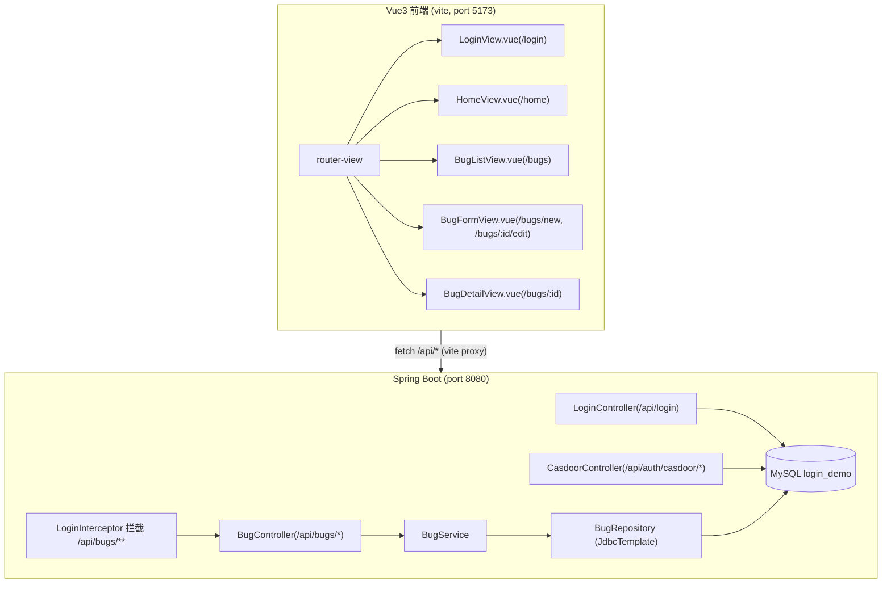

# Bug Tracking System (Bug 追踪系统)

Feature Name: bug-tracking-system
Updated: 2026-09-03

## Description

在现有 WebLogin 登录系统上扩展 Bug 追踪子系统。已登录用户可创建 Bug、按条件查找 Bug、查看 Bug 详情与字段级修改历史、编辑并保存 Bug。Bug 数据对所有登录用户共享；所有 Bug 写入类操作都通过后端 Session 鉴权识别操作人。

技术决策（已与用户确认）：
- 后端 API 采用 **HttpSession 鉴权**：数据库登录与 Casdoor SSO 登录成功后统一写入 session 属性 `loginUser`；对 `/api/bugs/**` 使用拦截器校验，未登录返回 401。
- 前端引入 **vue-router@4**，页面结构：登录页 / 首页 / Bug 列表 / Bug 新建 / Bug 详情 / Bug 编辑。
- Bug **状态自由切换**，不做顺序约束。
- 修改历史采用 **字段级变更记录**，一次保存涉及多个字段时以 JSON 数组存储。

## Architecture



## Components and Interfaces

### 数据模型

数据库沿用 `login_demo`，新增两张表（追加进 `/workspace/schema/schema.sql`）：

```sql
CREATE TABLE IF NOT EXISTS `bug` (
  `id`         bigint      NOT NULL AUTO_INCREMENT,
  `title`      varchar(200) NOT NULL,
  `description` text        NULL,
  `status`     varchar(20) NOT NULL DEFAULT '打开',
  `severity`   varchar(20) NOT NULL DEFAULT '一般',
  `creator`    varchar(50) NOT NULL,
  `assignee`   varchar(50) NULL,
  `created_at` datetime    NOT NULL,
  `updated_at` datetime    NOT NULL,
  PRIMARY KEY (`id`),
  KEY `idx_status` (`status`),
  KEY `idx_severity` (`severity`),
  KEY `idx_assignee` (`assignee`)
) ENGINE=InnoDB DEFAULT CHARSET=utf8mb4 COLLATE=utf8mb4_unicode_ci;

CREATE TABLE IF NOT EXISTS `bug_history` (
  `id`         bigint      NOT NULL AUTO_INCREMENT,
  `bug_id`     bigint      NOT NULL,
  `operator`   varchar(50) NOT NULL,
  `operated_at` datetime   NOT NULL,
  `changes`    text        NOT NULL,
  PRIMARY KEY (`id`),
  KEY `idx_bug_id` (`bug_id`)
) ENGINE=InnoDB DEFAULT CHARSET=utf8mb4 COLLATE=utf8mb4_unicode_ci;
```

枚举取值：
- `status`: 打开 / 处理中 / 已修复 / 已关闭
- `severity`: 轻微 / 一般 / 严重 / 致命

`changes` 为 JSON 数组，元素形如：
```json
[{"field": "status", "old": "打开", "new": "处理中"}, {"field": "assignee", "old": null, "new": "user1"}]
```
中文枚举值直接落库以便展示；合法性由后端校验。

### 后端接口

统一返回结构沿用 `ApiResponse`：`{ code, message, data }`，`code=0` 表示成功。未登录返回 `code=401`。

| 方法 | 路径 | 鉴权 | 说明 |
|------|------|------|------|
| POST | /api/login | 无 | 数据库登录，成功后 session 写入 `loginUser` |
| GET | /api/auth/casdoor/login | 无 | Casdoor SSO 发起 |
| GET | /api/auth/casdoor/callback | 无 | SSO 回调，成功后 session 写入 `loginUser`（统一用用户名 `user.name`） |
| GET | /api/bugs | Session | 列表查询，支持 `keyword/status/severity/assignee/page/size`，按创建时间倒序 |
| GET | /api/bugs/{id} | Session | Bug 详情 |
| POST | /api/bugs | Session | 创建 Bug，body: `{title, description, severity, assignee}`，status 默认"打开"，creator 取自 session |
| PUT | /api/bugs/{id} | Session | 编辑保存，body 可含全部可编辑字段，做字段级 diff 并写历史 |
| GET | /api/bugs/{id}/history | Session | 修改历史，按 operated_at 正序 |

后端新增组件（沿用 JdbcTemplate 原生 SQL，不引入 ORM）：
- `LoginInterceptor`：校验 session 中 `loginUser` 是否存在；注册拦截 `/api/bugs/**`。
- `WebConfig`：注册拦截器，放行 `/api/login`、`/api/auth/**` 及静态资源。
- `BugController`：REST 入口，参数校验后委托 Service。
- `BugService`：业务逻辑（字段校验、diff 计算、事务编排）。
- `BugRepository`：JdbcTemplate 封装 SQL（查询单条用 RowMapper，写入用 KeyHolder 取自增 ID）。
- `LoginController` 改造：登录成功后 `session.setAttribute("loginUser", username)`。
- `CasdoorController` 改造：SSO 成功后将 session 属性统一为 `loginUser`（值为 `user.name`），并保留前端跳转参数。

### 前端页面

引入 `vue-router@4`，新增 `src/router/index.ts`，并调整 `main.ts` 挂载 router。

| 路由 | 组件 | 说明 |
|------|------|------|
| /login | LoginView | 数据库登录表单 + Casdoor SSO 按钮 |
| /home | HomeView | 欢迎页（登录后默认跳转 /bugs） |
| /bugs | BugListView | 列表 + 筛选（关键词/状态/严重程度/指派处理人）+ "新建 Bug" |
| /bugs/new | BugFormView | 创建模式表单 |
| /bugs/:id | BugDetailView | 详情 + 字段级修改历史时间线 |
| /bugs/:id/edit | BugFormView | 编辑模式表单（回显当前值） |

路由守卫：访问受保护页面前校验 `localStorage.login_user`；不存在则重定向 `/login`。前端仍用 localStorage 维护 UI 登录态，后端以 session 做 API 真实性校验，两者互补。API 层统一封装 `fetch`，收到 `code=401` 时清除本地登录态并跳转登录页。

### 安全约束

- 创建/修改 Bug 的 `creator/operator` 一律从 session 读取，前端不可伪造。
- `description` 采用文本渲染，不在前端使用 `v-html` 展示用户内容，防 XSS。
- 登录页与首页前端会校验登录态，但数据可信性以后端 Session 为准。

## Correctness Properties

1. 每次对 Bug 的字段级更新（title/description/status/severity/assignee）与变更历史写入处于同一数据库事务，提交即原子成功。
2. 若保存请求与当前值完全一致，系统不产生任何新历史记录。
3. `status`、`severity` 只接受白名单值，否则拒绝保存。
4. Bug 创建成功必然伴随一条历史记录（operator=creator，标记创建动作的全部初始字段）。
5. `updated_at` 在每次有效更新时刷新为当前时间。
6. 并发保存以最后一次成功提交为准，事务与行锁保证历史不丢失。

## Error Handling

| 场景 | 响应 |
|------|------|
| 未登录访问 /api/bugs/** | HTTP 401，body `code=401 message=未登录` |
| Bug 不存在（GET/PUT /api/bugs/{id}） | `code=404` message=记录不存在 |
| 创建/保存缺 title | `code=400` message=标题不能为空 |
| status/severity 非法 | `code=400` message=参数不合法 |
| 前端 API 401 | 清 localStorage，跳转 /login |

## Test Strategy

- **后端**：端到端冒烟验证（curl 模拟已登录 Session 与未登录访问）：
  1. 未登录 GET /api/bugs → 401。
  2. POST /api/login 登录 → 携带 Cookie GET/POST/PUT /api/bugs 全链路。
  3. 创建 Bug → 查列表命中 → 编辑若干字段 → history 返回字段级变更明细。
  4. 无变化保存不产生历史。
- **前端**：`npm run type-check` 通过，浏览器手工验证列表/筛选/新建/编辑/历史与 401 跳转。
- **数据库**：建表 SQL 幂等可重复执行。

## References

- (Filename#/workspace/backend/src/main/java/com/example/login/LoginController.java) - 数据库登录，待补 session
- (Filename#/workspace/backend/src/main/java/com/example/login/CasdoorController.java) - SSO 回调，待统一 loginUser 属性
- (Filename#/workspace/schema/schema.sql) - 追加 bug / bug_history 表
